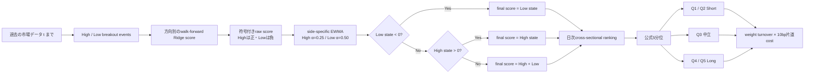

# SN1 Strategy Description Drafts

## A. 100字程度 — フォーム短文用

過去250営業日の高値・安値を終値で更新した事象を別々に推定し、負のLow状態があれば優先し、なければ正のHigh状態を用います。日次5分位でQ4/Q5をLong、Q1/Q2をShortとし、片道10bpを控除します。

## B. 300〜500字 — 一般的な説明欄用

本戦略は、株価が過去250営業日の高値または安値を終値で更新した事象を、上方向と下方向に分けて評価します。各方向について、過去に確定したデータから年次walk-forwardのRidgeモデルで事象の強さを推定し、上方向は正、下方向は負のスコアにします。銘柄ごとにHigh状態はalpha 0.25、Low状態はalpha 0.50のEWMAで平滑化します。最終スコアは、負のLow状態がある銘柄ではそのLow状態を採用し、Low状態がゼロで正のHigh状態がある銘柄ではHigh状態を採用し、それ以外は両状態の合計を使います。日次スコアを公式の5分位に分け、Q4/Q5をLong、Q1/Q2をShort、Q3を中立とします。重み・売買コストはコンペの評価仕様に合わせ、片道10bpを控除します。特徴量とモデルは過去時点の情報だけで計算し、学習ラベルは2営業日purgeしてから利用します。候補はTrain内で事前登録した比較に限り、Validは未使用です。この説明はTrain由来の研究仮説であり、OOS確認を意味しません。

## C. 1ページ程度 — 技術審査用

### 仮説

本戦略は、過去の価格レンジを上または下へ抜けた事象が、その後の銘柄間の相対的な強さに関係する可能性を検証します。上方breakoutと下方breakoutは符号の異なる情報源なので、同じスカラーへ加算するだけでは、それぞれがスコアに与える方向を解釈しにくくなります。SN1では、負のLow状態が残る銘柄はLow側の状態をそのまま使い、Low状態が消えた後に正のHigh状態が残る銘柄はHigh側を使います。この説明はコードから支持できる範囲に限り、投資家心理、企業ファンダメンタルズ、overnight market microstructureに関する説明は加えません。

### Signal construction

シグナル日tの終値が、tより前の250観測で計算した高値上限を超えればHigh event、安値下限を下回ればLow eventです。比較に当日データは含めません。価格はraw OHLCを使い、分割時に観測済みのfactorだけで単位を揃えます。box/contextはt−1までに確定した価格から計算し、固定された5営業日刻みの5〜120営業日レンジを調べます。上向きモデルと下向きモデルは別々に学習し、boxの長さ・幅、向きを揃えたbox内位置、60営業日の市場残差相対強度、過去極値までの距離を使います。モデルは年ごとのpast-to-future Ridgeで、lambda=1.0。学習ラベルは翌営業日寄付から翌々営業日寄付までの1日残差リターンの断面順位で、fold境界では2営業日のpurgeを入れます。イベントのない日にはraw scoreがゼロとなり、EWMA状態はゼロへ減衰します。

High raw scoreは非負、Low raw scoreは非正です。High状態はalpha=0.25、Low状態はalpha=0.50のEWMAで更新します。各銘柄のsegment初期状態は最初のraw scoreで、その後にEWMAを適用します。保存済みbase scoreからraw系列を復元する研究実装では、復元raw値の絶対値が`1e-12`未満の場合にゼロへ丸めます。これは逆EWMA時の数値cleanupで、モデルのalphaや探索した予測thresholdではありません。最終scoreの優先順位は次のとおりです。

1. `Low state < 0` なら final score はLow state。High stateが同時に正でもLow stateを使います。
2. それ以外で `High state > 0` なら final score はHigh state。符号制約上、この分岐ではLow stateはゼロです。
3. それ以外は既存D score `High state + Low state`。通常はゼロです。

この変換は銘柄ごとに一つの連続値を作ります。LongとShortに別々のモデルや保有ルールを適用するものではありません。

### Portfolio construction and costs

各日、既存の全ユニバーススコアをCode順の安定したtie-breakで順位付けし、5分位に分類します。Q1/Q2のweightをShort、Q3をゼロ、Q4/Q5のweightをLongとする公式重みを維持します。信号に応じて日中・夜間に別売買を行わず、ポートフォリオの重み差に対して片道10bpをコストとして計上します。SN1はHigh/Lowのイベント定義、alpha、特徴量、モデル、ユニバース、コスト、quintile weight式を変更していません。

### Leak prevention and research discipline

全特徴量はsignal dateまでに観測可能な価格・リターンから計算します。250観測のHigh/Low基準は過去にshiftし、未来値の補完や将来targetを特徴量として使いません。walk-forward学習ではラベル成熟に2日purgeを入れます。保存済みTrain runではsuffix mutationによるprefix-invarianceが3 cutoffで一致し、Validは開いていません。SN1の条件は、既に認識されていたTrainのShort × Night損失構造を受けて候補planに記録し、そのplan hashを固定して2候補のみを比較しました。Train全体はすでに既知だったので、この結果をOOS性能や独立した因果証明とは呼びません。

### 検証上の限界

既知TrainではNet SharpeがDの0.808から1.063へ上がりましたが、Short全体はNet-negativeのままで、Short × Night Net寄与は−5.483%から−6.001%へ悪化しました。改善は主に低turnover/costとLong側に現れます。保存scoreの多くはゼロ近傍にあり、5分位tie-boundaryの一部がCode順に依存します。従って、この説明を用いる場合も「Short × Nightを解決した」「独立検証済み」「全スコアが経済的に明確な強度を表す」とは述べません。

## 図解

## 書いてはいけない誇張表現

- 「Short × Nightの損失を解決した」— SN1は同セルを0.517 pp悪化させた。
- 「Short alphaを改善した」— Short Netは−1.591%から−1.644%へ悪化した。
- 「OOSで確認済み」「独立検証済み」— 全結果は既知のTrain期間。
- 「turnover低下は情報が安定した証拠」— 順位固定化と極小scoreの影響を分離できていない。
- 「ticker順に依存しない」— 同点を逆Code順にするだけでSN1の5.29%のquintile labelsが変わった。
- 「全スコアに明瞭な経済的な強度がある」— SN1の絶対scoreの81.11%が`1e-8`未満。
- 「Sharpeを最大化するためにこのルールを発見した」— SN1はShort × NightのTrain構造診断から作られたTrain-derived hypothesisであり、改善の独立確認ではない。
